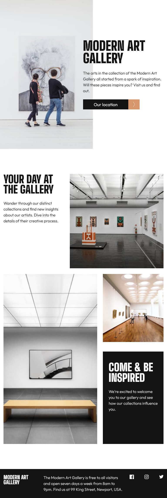

# Frontend Mentor - Art gallery website solution

This is a solution to the [Art gallery website challenge on Frontend Mentor](https://www.frontendmentor.io/challenges/art-gallery-website-yVdrZlxyA). Frontend Mentor challenges help you improve your coding skills by building realistic projects. 

## Table of contents

- [Overview](#overview)
  - [The challenge](#the-challenge)
  - [Screenshot](#screenshot)
  - [Links](#links)
- [My process](#my-process)
  - [Built with](#built-with)
  - [What I learned](#what-i-learned)
  - [Continued development](#continued-development)
  - [Useful resources](#useful-resources)
- [Author](#author)
- [Acknowledgments](#acknowledgments)

## Overview

### The challenge

Users should be able to:

- View the optimal layout for each page depending on their device's screen size
- See hover states for all interactive elements throughout the site
- **Bonus**: Use [Leaflet JS](https://leafletjs.com/) to create an interactive location map with custom location pin

### Screenshot





### Links

- Solution URL: [Add solution URL here](https://your-solution-url.com)
- Live Site URL: [Add live site URL here](https://art-gallery-chamu.netlify.app)
- aws live site url: [AWS LIVE SITE URL](https://master.dn9hq5jjohwet.amplifyapp.com/)

## My process

### Built with

- Semantic HTML5 markup
- CSS custom properties
- Flexbox
- Mobile-first workflow
- [react-responsive-masonry](https://www.npmjs.com/package/react-responsive-masonry) - masonry library
- [React](https://reactjs.org/) - JS library
- [React router](https://reactrouter.com/) - React framework
- [Sass](https://sass-lang.com/) - For styles


### What I learned

another way of using a svg image in a react application
- import **ReactComponent** then use the path
- see the jsx below for usage

```react
import { ReactComponent as Facebook } from "../../assets/icon-twitter.svg"

<li>
     <a href="/" className="social-item" aria-label="visit our facebook page" >
         <Facebook title="facebook page" className="facebook" aria-hidden="true" />
       </a>
 </li>
 
```

### Continued development
- improve the accessibility of the site

### Useful resources

- [Generate favicon icon](https://reactgo.com/react-change-favicon/) - favicon for the project

## Author

- Website - [Chamu Mutezva](https://github.com/ChamuMutezva)
- Frontend Mentor - [@ChamuMutezva](https://www.frontendmentor.io/profile/ChamuMutezva)
- Twitter - [@ChamuMutezva](https://twitter.com/ChamuMutezva)


## Acknowledgments

Frontend Mentor
